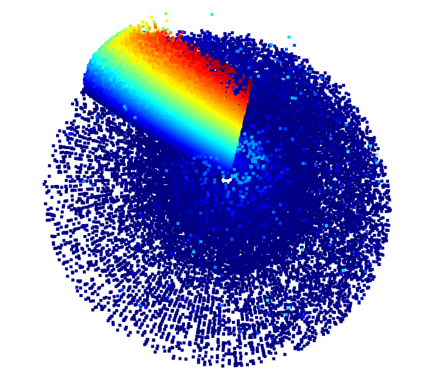

# Lidar Point Cloud Visualization in 3D

## Overview

This project creates a 3D visualization of LiDAR (Light Detection and Ranging) data using Python. It processes raw LiDAR point cloud data stored in Parquet files, converts spherical coordinates to Cartesian coordinates, and visualizes the resulting point cloud in 3D space.

## Features

- Reads LiDAR data from Parquet files
- Converts spherical coordinates (range, azimuth, elevation) to Cartesian coordinates (x, y, z)
- Aggregates multiple point clouds into a single visualization
- Renders a 3D point cloud visualization using Open3D

## Requirements

- Python 3.7+
- pandas
- numpy
- open3d

## Installation

**1. Clone the repository:**
   ```
git clone https://github.com/Siddartha-Kodaboina/Lidar-Point-Cloud-3D-Visualization.git
   ```

**2. Install the required packages:**
```
pip install -r Code/requirements.txt
```

**3. GetData**

1. Create a Data folder at the root of the project:
```mkdir Data```
2. Download the LiDAR data from the following link: [LiDAR Data](https://drive.google.com/file/d/1fSCuJ439CxwtkZXsWsZ7DnZ9ohlgMFbY/view?usp=sharing)
3. Place the downloaded file in the Data folder.


## Usage

1. Replace the `parquet_file_path` in the script with the path to your Parquet file containing LiDAR data.

2. Run the script:
```
python Code/visualize_lidar.py
```

3. The script will process the data and open a window displaying the 3D point cloud visualization.

## Code Explanation

The main function `create_aggregated_point_cloud` performs the following steps:

1. Reads the LiDAR data from the Parquet file
2. Reshapes the range image data
3. Extracts ranges, azimuths, and elevations
4. Converts spherical coordinates to Cartesian coordinates
5. Creates a point cloud using Open3D
6. Visualizes the aggregated point cloud

## Data Format

The script expects LiDAR data stored in a Parquet file with the following columns:
- `[LiDARComponent].range_image_return1.values`: Contains the range image data
- `[LiDARComponent].range_image_return1.shape`: Contains the shape of the range image

## Visualization

The resulting visualization will display a 3D point cloud representing the LiDAR data. You can interact with the visualization using your mouse:
- Left-click and drag to rotate the view
- Right-click and drag to pan
- Scroll to zoom in/out
## License

This project is licensed under the MIT License - see the [LICENSE](LICENSE) file for details.

## Acknowledgments

- This project uses the Open3D library for 3D visualization.
- various research papers and open-source projects inspire LiDAR data processing techniques in the field of autonomous driving and computer vision.
